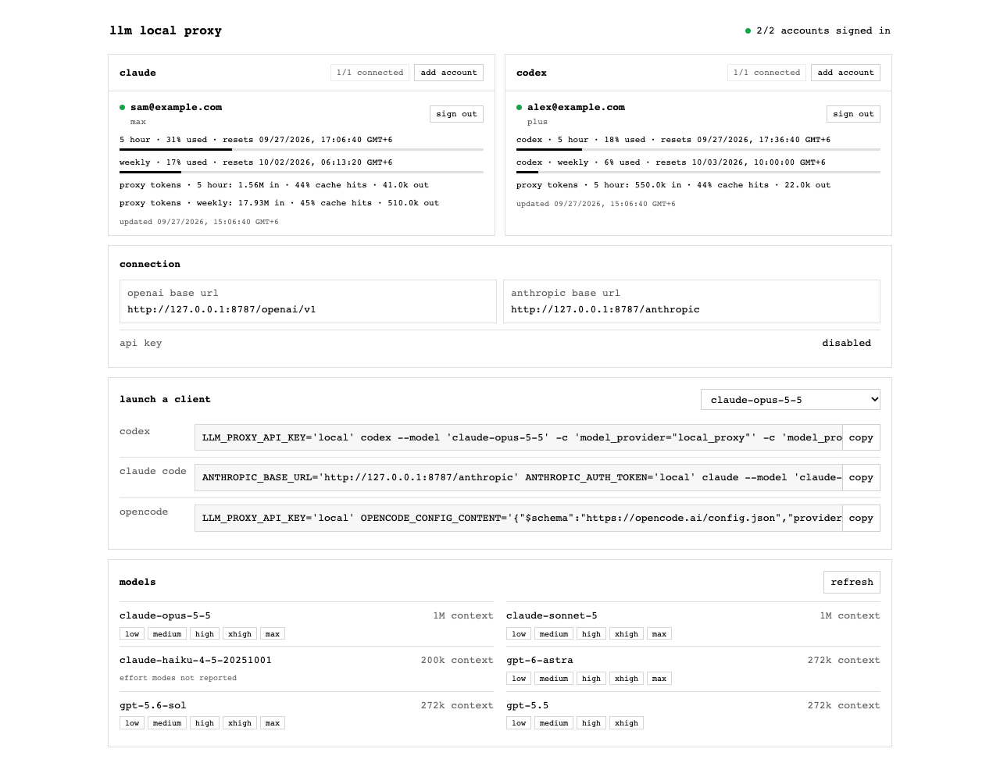

# LLM Local Proxy

A small OpenAI-compatible gateway for your own Codex (ChatGPT) and Claude
subscriptions. Your client keeps the agent and tool loop; this process only
translates the protocol.



_Account and key above are placeholders; the dashboard reads your own local
accounts at runtime._

## Run

Native installs require [uv](https://docs.astral.sh/uv/) and the
[Codex binary](https://github.com/openai/codex). The proxy starts its
`app-server`; Docker includes both.

```sh
uv tool install .
llm-local-proxy
```

Open the URL printed at startup. The first run creates a private config and
random API key; the printed URL carries it in the browser fragment. Sign in,
then copy the base URL and key into your client.

Use `http://127.0.0.1:8787/api/v1` as an OpenRouter-compatible base URL,
the generated key as a bearer token, and any model listed on the status page.

## Example request

This streams a selected Codex model and lets it search when needed:

```sh
curl -N http://127.0.0.1:8787/api/v1/chat/completions \
  -H "Authorization: Bearer $LLM_PROXY_API_KEY" \
  -H "Content-Type: application/json" \
  -d '{
    "model": "gpt-5.6-sol",
    "stream": true,
    "messages": [
      {"role": "user", "content": "What changed in Codex this week? Cite sources."}
    ],
    "tools": [
      {
        "type": "openrouter:web_search",
        "parameters": {"search_context_size": "low"}
      }
    ]
  }'
```

The stream uses Chat Completions chunks, OpenRouter-style `url_citation`
annotations, and `server_tool_use.web_search_requests` in the final usage chunk.
`openrouter:web_search` is only OpenRouter's wire name for server-side search,
which the proxy maps to the upstream's own tool; no OpenRouter account or key is
involved, and the search runs inside the subscription serving the request.

## Claude subscription

The same endpoint can also serve Claude models from a Claude subscription.
Sign in from the status page; the proxy runs the same OAuth flow as the
Claude Code CLI and keeps its own token pair in `claude-credentials.json`
next to the config. It refreshes that pair itself, so it does not contend
with Claude Code logins on other machines. In Docker the file lives in the
`proxy-config` volume.

Requests for any `claude-*` model route to the Messages API; everything
else routes to Codex as before. `GET /v1/models` merges the live Anthropic
catalog (output limits, reasoning-effort levels) with the Codex model list
and falls back to a small static table when Claude is not signed in.
Both subscriptions keep their own usage windows and rate limits.

## Docker

```sh
docker compose up --build
```

Compose publishes only `127.0.0.1:8787`; config and Codex login state live in
named volumes and survive container restarts. `docker compose down -v` deletes
both volumes.

## API

The proxy speaks two downstream formats over the same subscriptions, each
mounted under its own prefix. Either format reaches either provider: the
request's `model` chooses.

OpenAI Chat Completions, at `/openai/v1`:

- `GET /openai/v1/models` with Codex and Claude capabilities and `?q=` search
- `GET /openai/v1/models/count`
- `POST /openai/v1/chat/completions`
- streaming, images, function tools, web search, parallel calls, reasoning
  effort, usage

Anthropic Messages, at `/anthropic`:

- `POST /anthropic/v1/messages`, streaming with named SSE events
- `POST /anthropic/v1/messages/count_tokens`, exact for `claude-*` models;
  `404` for Codex ones, whose upstream cannot count. A client that gets the
  404 falls back to its own estimate knowing it is one
- `GET /anthropic/v1/models`
- authenticates with `x-api-key` as well as `Authorization: Bearer`

The unprefixed `/v1/...` paths are the Chat Completions mount as it was
before the prefixes existed, and stay valid: `/v1/chat/completions` and
`/openai/v1/chat/completions` are the same endpoint. Prefixes exist because
the two formats disagree about what `/v1/models` returns.

```sh
# Claude Code, or any Anthropic SDK
ANTHROPIC_BASE_URL=http://127.0.0.1:8787/anthropic \
  ANTHROPIC_API_KEY=$YOUR_LOCAL_PROXY_KEY claude

# Any OpenAI-compatible client
OPENAI_BASE_URL=http://127.0.0.1:8787/openai/v1 \
  OPENAI_API_KEY=$YOUR_LOCAL_PROXY_KEY
```

Asking either endpoint for the other vendor's model routes it there and
translates both ways, so Claude Code can drive Codex and an OpenAI SDK can
drive Claude. The dashboard prints the base url for every mounted format.
- `GET /api/status` with each provider's account, limits, and proxy token counts
- `POST /api/codex/login`, `POST /api/codex/logout`
- `POST /api/claude/login`, `POST /api/claude/code`, `POST /api/claude/usage`,
  `POST /api/claude/logout`

Common to both: the request's `model` selects the Codex or Claude model. Responses
include prompt, completion, cached, and reasoning token counts. The proxy does
not invent per-token pricing, cost, provider routing, or generation history:
subscriptions do not expose truthful equivalents.

## OpenRouter compatibility

Both OpenAI's `/v1/...` and OpenRouter's `/api/v1/...` prefixes work. Supported
OpenRouter-style behavior includes model selection, model metadata/search/count,
streaming Chat Completions, tools, images, reasoning effort, and token usage.
Function calls are returned to the client for execution; only web search runs
upstream, with source annotations and search usage returned in the stream.
`max_tokens` and `max_completion_tokens` are hints on Codex, which controls its
own output length, but the Messages API requires a limit: Claude sends the
requested value or the model's maximum, and that limit also bounds any thinking
budget from `reasoning_effort`, so a small one caps reasoning too. Unsupported
sampling and structured-output parameters fail explicitly rather than being
ignored, unless the value is a no-op. Pricing, provider preferences/fallbacks,
key spend, and generation-cost history are intentionally absent: neither
subscription exposes equivalent data.

API routes require the generated bearer key; the dashboard and `/healthz` do
not, and a key must be empty or at least 24 characters. Set `api_key = ""` to
disable authentication. Native installs always reject non-loopback bind
addresses. With Docker, no-auth mode is safe only while the port remains
published to `127.0.0.1` as supplied. Never publish it on all interfaces.
Change the port or key in:

```toml
host = "127.0.0.1"
port = 8787
api_key = "long-random-local-secret"
codex_home = "~/.codex"
codex_binary = "codex"
request_timeout = 600
```

The default path is `~/.config/llm-local-proxy/config.toml`; pass
`--config PATH` to use another. Config files must be readable only by their
owner (`chmod 600`).

## Development

[docs/architecture.md](docs/architecture.md) is the architecture of record:
the dialect/provider/auth axes, the migration that gets there, and the wire
contracts each downstream endpoint must honour. `specs/` holds the pinned
OpenAI and Anthropic specifications those contracts are checked against;
refresh them with `scripts/refresh-specs.sh`.

```sh
uv sync
uv run python -m unittest discover -s tests -v
uv run ruff check src tests
uv run ruff format --check src tests
```

Codex app-server owns login, refresh, models, and account limits. Keeping the
binary avoids reimplementing undocumented ChatGPT authentication. The small
private transport and credential adapters may change with Codex. Use the public
OpenAI API when a supported third-party integration is required.

## Disclaimer

This project is an unofficial, independent wrapper around the publicly
distributed [Codex CLI](https://github.com/openai/codex) and the subscription
endpoints used by Anthropic's Claude Code. It is not affiliated with, endorsed
by, or supported by OpenAI or Anthropic.

Use at your own risk. The authors make no claims regarding compliance with
OpenAI's or Anthropic's Terms of Service. It is your responsibility to review
and comply with the OpenAI Terms of Use and Usage Policies and Anthropic's
Consumer Terms of Service and Usage Policy, including whatever they say about
programmatic access to a subscription. Terms may change at any time.

The proxy runs entirely on your machine against your own authenticated
accounts. No API keys are intercepted, no authentication is bypassed, and no
credentials leave your device: Codex login and refresh are delegated to the
official binary, and Claude tokens are obtained through the same OAuth flow the
first-party client uses and stored only in your local config directory.

It does, however, speak two undocumented interfaces — the Codex app-server
JSON-RPC surface and the Claude subscription Messages transport, including the
client identifiers and beta headers that identify first-party traffic. These
have no public specification, may change or break without notice, and their use
may fall outside what your subscription permits. Use the paid OpenAI or
Anthropic APIs when a supported integration is required.
