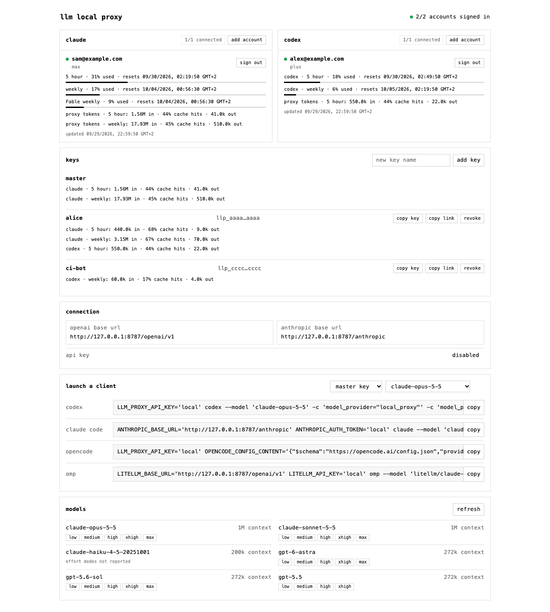

# LLM Local Proxy

Use your Claude and ChatGPT (Codex) subscriptions from any tool that speaks the
OpenAI or Anthropic API. The proxy runs on your machine, signs in with your
own accounts, and translates between the formats; your tools keep working as
they are.



- **Any client, any model.** Chat Completions, Responses and Messages all
  reach both subscriptions; the `model` you ask for picks the upstream.
- **Full protocol.** Streaming, tools, images, reasoning, web search,
  structured output and prompt caching are translated, not dropped.
- **Several accounts.** Add more than one login per subscription; the proxy
  spreads conversations across them and steps around rate limits.
- **Small.** One static binary, a 6 MB container image, about 3 MB of memory.

## Install

With Docker:

```sh
git clone https://github.com/timongentzsch/llm-local-proxy
cd llm-local-proxy
docker compose up -d --build
docker compose logs proxy      # prints the dashboard link
```

Or with a [Rust toolchain](https://rustup.rs):

```sh
cargo install --git https://github.com/timongentzsch/llm-local-proxy
llm-local-proxy
```

## Get started

1. Open the link printed at startup (`http://127.0.0.1:8787/#key=...`). The
   part after `#key=` is your API key.
2. On the dashboard, click **sign in** under Claude, Codex or both, and
   follow the prompt.
3. Point a client at the proxy. The dashboard has ready-made commands for
   Claude Code, Codex CLI, OpenCode and OMP; for anything else use:

| Client speaks | Base URL | API key |
| --- | --- | --- |
| OpenAI (Chat Completions, Responses) | `http://127.0.0.1:8787/openai/v1` | your key |
| Anthropic (Messages) | `http://127.0.0.1:8787/anthropic` | your key |

```sh
# Claude Code, on any model of either subscription
ANTHROPIC_BASE_URL=http://127.0.0.1:8787/anthropic ANTHROPIC_AUTH_TOKEN=$KEY \
  claude --model gpt-5.6-sol

# Any OpenAI-compatible client
curl http://127.0.0.1:8787/openai/v1/chat/completions \
  -H "Authorization: Bearer $KEY" -H "Content-Type: application/json" \
  -d '{"model": "claude-sonnet-5", "messages": [{"role": "user", "content": "Hello"}]}'
```

`GET /openai/v1/models` lists every model your accounts can use.

## Endpoints

| Mount | Routes |
| --- | --- |
| `/openai/v1` (also `/v1`) | `chat/completions`, `responses`, `models`, `models/count` |
| `/anthropic` | `v1/messages`, `v1/messages/count_tokens`, `v1/models` |

The key is accepted as `Authorization: Bearer` or `x-api-key` everywhere.
`models` takes `?q=` to filter and `?refresh=1` to skip the one-minute cache.
`GET /healthz` needs no key.

## Configuration

`~/.config/llm-local-proxy/config.toml` is created on first run (in Docker: in
the `proxy-config` volume). Use `--config PATH` for another file and
`--show-config` to print the path. The file must be readable only by you.

| Option | Default | Meaning |
| --- | --- | --- |
| `host`, `port` | `127.0.0.1`, `8787` | Where the proxy listens. Loopback only. |
| `api_key` | generated | The master key. Empty turns authentication off. |
| `request_timeout` | `600` | Seconds an upstream may stay silent. |
| `codex_home` | `~/.codex` | Where Codex logins are kept. |
| `claude_client_version` | `2.1.292` | Raise it if Claude asks for a newer Claude Code. |
| `codex_client_version` | `0.160.0` | Raise it if a new GPT model is missing from the list. |
| `public_host`, `public_port`, `public_url` | off | The listener for other machines; see below. |

## Sharing it

The master key opens the dashboard and manages accounts, and works only on
the local listener. To let other people or machines use the proxy, create
**named keys** in the dashboard's keys panel. A named key can call every model
and see its own usage, nothing else; revoking it takes effect immediately.

Named keys are meant for the public listener, which is off until you set
`public_port`. It serves only the model API and refuses the master key.

```toml
public_port = 8788
public_url = "https://mac.example.ts.net"   # how others reach it
```

- **Tailscale Serve (recommended).** Keep the default `public_host`, run
  `tailscale serve --bg 8788`, and set `public_url` to the address it gives
  you. Traffic is encrypted and limited to your tailnet.
- **Direct.** Set `public_host = "0.0.0.0"` (in Docker, also publish the port
  in `compose.yaml`). This is plain HTTP: put a TLS proxy in front of it.

## Good to know

- **Several accounts.** A conversation stays on the account it started on, so
  its prompt cache stays warm. A rate-limited account is skipped until the
  time its provider names; a login that stops working shows on the dashboard.
- **Usage.** The bars are your subscription's own numbers, including your
  other clients. The token counts are the proxy's traffic only.
- **Unsupported requests are refused, not altered.** Anything the chosen
  model cannot do faithfully gets a 400 that says what.
- **Limits.** The Responses endpoint is stateless (`store`,
  `previous_response_id` and `background` are refused). `count_tokens` works
  for Claude models only.

[docs/behaviour.md](docs/behaviour.md) has the details of translation,
caching, reasoning, web search and account selection.

## Development

```sh
cargo fmt --check && cargo clippy --all-targets -- -D warnings
cargo test                 # unit tests and the conformance replay
cargo build --release
python3 tests/e2e/run.py target/release/llm-local-proxy
python3 tests/e2e/codex_login.py target/release/llm-local-proxy
```

`cargo test` replays recorded cases that pin the wire behaviour; the `e2e`
scripts run the binary against stand-ins for both upstreams.
[docs/architecture.md](docs/architecture.md) explains the design.

## Disclaimer

An unofficial, independent project, not affiliated with or endorsed by OpenAI
or Anthropic. It runs on your machine against your own accounts; credentials
are stored locally and sent only to their provider.

The proxy signs in with the OAuth flow and client id of each vendor's own CLI
and speaks their undocumented subscription interfaces. These may change
without notice, and using them may fall outside your subscription's terms;
review those terms and use the paid APIs where a supported integration is
required. No warranty.
